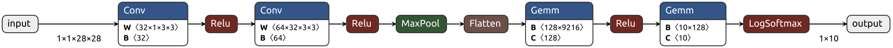

# Deep Learning Model Inference on MNIST using Raspberry PI 4


This repository provides examples to perform deep learning model inference on MNIST testing dataset (10,000 images) with a few different frameworks that's available on Raspberry Pi 4.

## Training
A basic [CNN model](https://github.com/pytorch/examples/tree/main/mnist) implemented with Pytorch was trained on a PC with Nvidia 3090.
```
=================================================================
Layer (type:depth-idx)                   Param #
=================================================================
Net                                      --
├─Conv2d: 1-1                            320
├─Conv2d: 1-2                            18,496
├─Dropout: 1-3                           --
├─Dropout: 1-4                           --
├─Linear: 1-5                            1,179,776
├─Linear: 1-6                            1,290
=================================================================
Total params: 1,199,882
Trainable params: 1,199,882
Non-trainable params: 0
=================================================================
```

To repeat the training and save the weights.
```
python train.py --save-model 
```

To export the Pytorch model to ONNX
```
python torch_to_onnx.py
```

Here is a computation graph of the model generated with [netron](https://netron.app/) from `model/mnist_cnn.onnx`


## Inference
A subset of 1000 test images are used to benchmark the performance between different deep learning frameworks.
| framework | time (s) |
| --------- | -------- |
| torch | 2.4196 |
| ONNX | 1.4245 |
| MNN | 2.1080 |

### Pytorch (1.13.0)
Unfortunately as of now, to install Pytorch on Raspberry Pi OS is a bit tedious. Here is the summary of my experience. 
1. Use the legacy version of [Raspberry Pi OS - bullseye](https://www.raspberrypi.com/software/operating-systems/#raspberry-pi-os-legacy) that comes with python 3.9.2
2. `pip install torch torchvision` with default version (`torch==2.1.0` and `torchvision==0.16.0`) gave segmentation fault. I even tried a few previous version from the official pip wheel but they all more or less gave me some issues.
3. Follow this [blog post](https://qengineering.eu/install-pytorch-on-raspberry-pi-4.html)'s instructions to install `torch==1.13.0` and `torchvision==0.14.0` from custom wheels. They also provided `torch==2.0.0` but that didn't work for me.

To perform inference using Pytorch.

```
python eval_torch.py

Time: 2.4195 seconds
Accuracy: 988/1000 (99%)
```

### ONNX
Installation is much more pleasant compare to torch. It's straight forward with `pip install onnxruntime`. To peform inference using the exported ONNX model (only nees `onnxruntime` and `numpy` which feels extremely light and nice)
```
python eval_onnx.py

Time: 1.4245 seconds
Accuracy: 988/1000 (99%)
```

### MNN
According to [this repository](https://github.com/Qengineering/LFFD-MNN-Raspberry-Pi-4), one of the model implemented with this framework was able to achieve **65 FPS** on the face detection task, which gives enough reason to compare its performance on a much simplier MNIST inference task.
| Model  | framework | model |size |  mAP | Jetson Nano<br/>2015 MHz | RPi 4 64-OS<br/>1950 MHz |
| ------------- | :-----: | :-----:  | :-----:  | :-----:  | :-------------:  | :-------------: |
| Ultra-Light-Fast| MNN | slim-320 | 320x240 | 67.1  | 70 FPS | 65 FPS |

Instruction for how to install the library can be found in [installation.md](eval_mnn/installation.md), it was more tedious than installing torch.

To perform inference using its python API
```
python eval_mnn.py

Time: 2.1080 seconds
Accuracy: 988/1000 (99%)
```

_To use its C++ API is still a work in progress and its likely to be faster..._

## TO-DO
If I can bare the pain of installing those packages, I would like to continue the benchmarks for this CNN model on all of the following platform.
- [x] torch
- [x] onnx
- [x] MNN (Python)
- [ ] tensorflow lite
- [ ] armnn/pyarmmnn
- [ ] MNN (C++)
- [ ] ncnn (C++)
- [ ] LibTorch (C++)