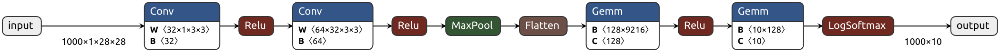

# Deep Learning Model Inference on MNIST using Raspberry PI 4


This repository provides examples to perform deep learning model inference on MNIST testing dataset (10,000 images) with a few different frameworks that's available on Raspberry Pi 4.

## Training
A basic [CNN model](https://github.com/pytorch/examples/tree/main/mnist) implemented with Pytorch was trained on a PC with Nvidia 3090.

To repeat the training and save the weights.
```
python train.py --save-model 
```

To export the Pytorch model to ONNX
```
python torch_to_onnx.py
```

Here is a computation graph of the model generated with [netron](https://netron.app/) from `model/mnist_cnn.onnx`


## Inference
A subset of 1000 test images are used to benchmark the performance between different deep learning frameworks.

### Pytorch (1.13.0)
For installation of Pytorch on a Raspberry Pi 4
1. Use the legacy version of [Raspberry Pi OS - bullseye](https://www.raspberrypi.com/software/operating-systems/#raspberry-pi-os-legacy)
2. `pip install torch torchvision` with default version (`torch==2.1.0` and `torchvision==0.16.0`) gave segmentation fault.
3. Follow this [blog post](https://qengineering.eu/install-pytorch-on-raspberry-pi-4.html) to install `torch==1.13.0` and `torchvision==0.14.0` from custom wheels.

To perform inference using Pytorch.

```
python eval_torch.py
```

### ONNX
Installation is very straight forward with `pip install onnxruntime`. To peform inference using `onnxruntime` on the exported **ONNX** model
```
python eval_onnx.py
```

### NCNN
